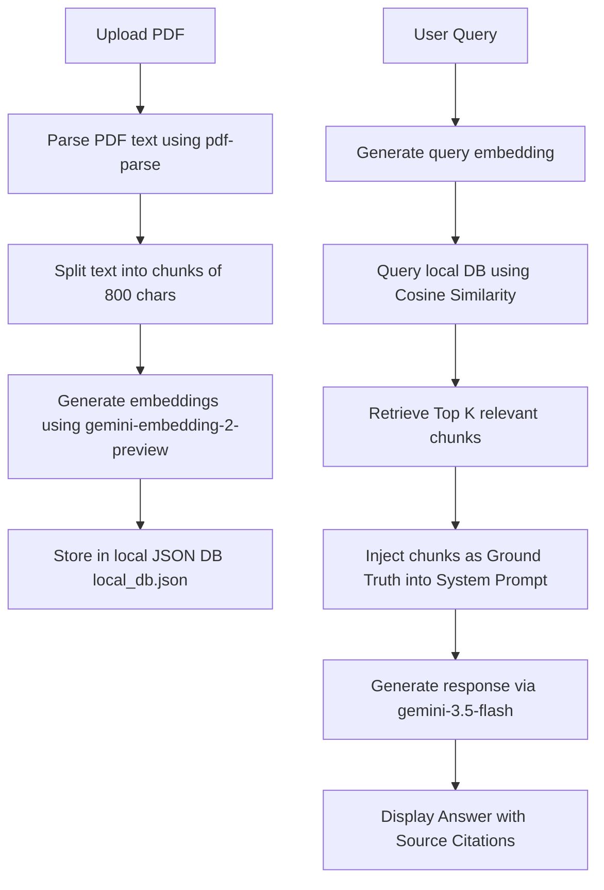

# PDF Scholar RAG

PDF Scholar RAG is a Retrieval-Augmented Generation (RAG) assistant designed for scholarly papers and PDF documents. It enables users to upload PDF documents, extract and chunk text, generate local embeddings using the Google Gemini API, store them in a persistent JSON-based vector database, and perform semantic searches. Users can chat with their documents with strict factual grounding and citations, test their knowledge with AI-generated interactive quizzes, and explore how RAG architectures function under the hood.

---

## 🚀 Key Features

*   **📄 PDF Ingestion & Text Extraction**: Parse uploaded PDF documents automatically into text and partition them into overlapping segments using recursive character splitting.
*   **🧠 Local Vector Database**: A robust custom in-memory vector storage system with persistent JSON serialization (`local_db.json`). Performs cosine similarity scoring on query inputs.
*   **🤖 Google Gemini API Integration**:
    *   **Embeddings**: Generates document and query embeddings using the `gemini-embedding-2-preview` model.
    *   **Grounded Q&A**: Employs `gemini-2.5-flash` / `gemini-3.5-flash` to answer user questions, fully citing references (e.g., `[Source 1]`) and strict grounding (no hallucinations or outside knowledge allowed).
    *   **Structured Quiz Generation**: Generates custom, interactive multiple-choice and short-answer quizzes directly from document contents.
*   **🎓 Interactive Learning Arena**: Take quizzes generated from document chapters, write your answers, receive instant feedback, score tracking, and detailed explanations of the correct concepts.
*   **🗺️ Interactive RAG Guide**: A built-in visualization of the RAG lifecycle to explain document chunking, semantic vector similarity, and LLM text generation to students and researchers.
*   **🎨 Ultra-Premium Modern UI**: Built with React, Vite, Tailwind CSS, Lucide icons, and fluid animations via Framer Motion.

---

## 🛠️ Tech Stack

*   **Frontend**: React (v19), Tailwind CSS, Framer Motion, Lucide React
*   **Backend**: Node.js, Express (v4), TSX, Esbuild
*   **AI Engine**: Google Gen AI SDK (`@google/genai`), `gemini-2.5-flash`, `gemini-3.5-flash`, `gemini-embedding-2-preview`
*   **PDF Parsing**: `pdf-parse`

---

## ⚙️ Prerequisites

*   [Node.js](https://nodejs.org/) (v18 or higher recommended)
*   A Gemini API Key (obtainable from [Google AI Studio](https://aistudio.google.com/))

---

## 🏃 Run Locally

Follow these steps to run the application on your local machine.

### 1. Clone & Install Dependencies
First, open your terminal and navigate to the project directory, then run:
```bash
npm install
```

### 2. Configure Environment Variables
Create a file named `.env` in the root of the project directory and specify your Gemini API key:
```env
GEMINI_API_KEY="YOUR_GEMINI_API_KEY_HERE"
```
*(Optionally, you can also copy `.env.example` as a template).*

### 3. Start the Development Server
To launch both the API server and the front-end Vite HMR server:
```bash
npm run dev
```
By default, the application will run at [http://localhost:3000](http://localhost:3000).

---

## 📦 Production Build & Deploy

To package and compile the application for production:

1. **Build the application**:
   ```bash
   npm run build
   ```
2. **Start the production server**:
   ```bash
   npm run start
   ```

---

## 🧬 How the RAG Pipeline Works



1. **Document Ingestion**: The PDF's raw text is extracted using `pdf-parse` and split into overlapping chunks (800 characters with 200 characters overlap) using the `RecursiveCharacterTextSplitter`.
2. **Embedding & Indexing**: Each text chunk is sent to the Gemini API (`gemini-embedding-2-preview`) to get its 768-dimension vector representation. The chunks and embeddings are stored in `local_db.json`.
3. **Retrieval**: When the user enters a question, the application generates a query embedding and runs a cosine similarity search against all stored chunks for the selected document.
4. **Augmented Generation**: The system retrieves the top 3 most relevant text chunks, formats them as ground-truth context, and appends them to a strict system prompt instruction instructing the Gemini model (`gemini-3.5-flash`) to answer using only that data.
