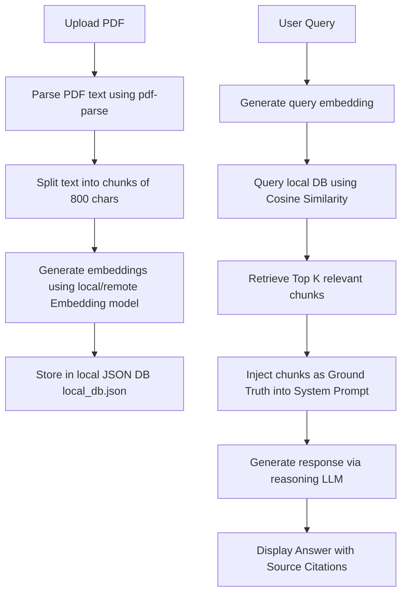

# PDF Scholar RAG

PDF Scholar RAG is a Retrieval-Augmented Generation (RAG) assistant designed for scholarly papers and PDF documents. It enables users to upload PDF documents, extract and chunk text, generate text embeddings, store them in a persistent JSON-based vector database, and perform semantic searches. Users can chat with their documents with strict factual grounding and citations, test their knowledge with interactive quizzes, and explore how RAG architectures function under the hood.

---

## 🚀 Key Features

*   **📄 PDF Ingestion & Text Extraction**: Parse uploaded PDF documents automatically into text and partition them into overlapping segments using recursive character splitting.
*   **🧠 Local Vector Database**: A robust custom in-memory vector storage system with persistent JSON serialization (`local_db.json`). Performs cosine similarity scoring on query inputs.
*   **🔌 LLM & Embeddings Integration**:
    *   **Embeddings**: Generates high-dimensional document and query embeddings for precise semantic search.
    *   **Grounded Q&A**: Employs a reasoning language model to answer user questions, fully citing references (e.g., `[Source 1]`) with strict grounding (no hallucinations or outside knowledge allowed).
    *   **Structured Quiz Generation**: Generates custom, interactive multiple-choice and short-answer quizzes directly from document contents.
*   **🎓 Interactive Learning Arena**: Take quizzes generated from document chapters, write your answers, receive instant feedback, score tracking, and detailed explanations of the correct concepts.
*   **🗺️ Interactive RAG Guide**: A built-in visualization of the RAG lifecycle to explain document chunking, semantic vector similarity, and LLM text generation to students and researchers.
*   **🎨 Ultra-Premium Modern UI**: Built with React, Vite, Tailwind CSS, Lucide icons, and fluid animations via Framer Motion.

---

## 🛠️ Tech Stack

*   **Frontend**: React (v19), Tailwind CSS, Framer Motion, Lucide React
*   **Backend**: Node.js, Express (v4), TSX, Esbuild
*   **LLM & Embeddings API**: Client integration for embeddings generation and language model generation
*   **PDF Parsing**: `pdf-parse`

---

## ⚙️ Prerequisites

*   [Node.js](https://nodejs.org/) (v18 or higher recommended)
*   An API key configured in the environment variables (see [Configure Environment Variables](#2-configure-environment-variables) below)

---

## 🏃 Run Locally

Follow these steps to run the application on your local machine.

### 1. Clone & Install Dependencies
First, open your terminal and navigate to the project directory, then run:
```bash
npm install
```

### 2. Configure Environment Variables
Create a file named `.env` in the root of the project directory and specify the API key:
```env
GEMINI_API_KEY="YOUR_API_KEY_HERE"
```
*(Optionally, you can also copy `.env.example` as a template).*

### 3. Start the Development Server
To launch both the API server and the front-end Vite HMR server:
```bash
npm run dev
```
By default, the application will run at [http://localhost:3000](http://localhost:3000).

---

## 📦 Production Build & Deploy

To package and compile the application for production:

1. **Build the application**:
   ```bash
   npm run build
   ```
2. **Start the production server**:
   ```bash
   npm run start
   ```

---

## 🧬 How the RAG Pipeline Works


```mermaid
graph TD
    A[Upload PDF] --> B[Parse PDF text using pdf-parse]
    B --> C[Split text into chunks of 800 chars]
    C --> D[Generate embeddings using local/remote Embedding model]
    D --> E[Store in local JSON DB local_db.json]
    
    F[User Query] --> G[Generate query embedding]
    G --> H[Query local DB using Cosine Similarity]
    H --> I[Retrieve Top K relevant chunks]
    I --> J[Inject chunks as Ground Truth into System Prompt]
    J --> K[Generate response via reasoning LLM]
    K --> L[Display Answer with Source Citations]
```

1. **Document Ingestion**: The PDF's raw text is extracted using `pdf-parse` and split into overlapping chunks (800 characters with 200 characters overlap) using the `RecursiveCharacterTextSplitter`.
2. **Embedding & Indexing**: Each text chunk is processed using the embedding model to obtain a high-dimensional vector representation. The chunks and their corresponding embeddings are stored in the local JSON vector database (`local_db.json`).
3. **Retrieval**: When a query is entered, the system generates a query embedding and performs a cosine similarity search against all stored chunks for the selected document.
4. **Augmented Generation**: The system retrieves the top 3 most relevant text chunks, formats them as ground-truth context, and inserts them into a strict system prompt instructing the language model to answer the query using only the provided context.

